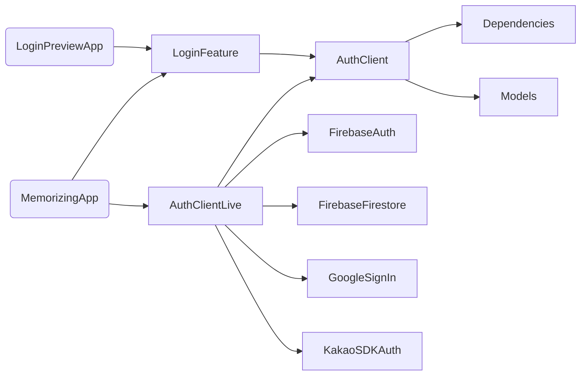

# Memorizing 

### Index
* [Screenshots of the app](#Screenshots-of-the-app)
* [Description](#Description)
* [Dependency Graph](#Dependency-Graph)
* [Getting Started](#Getting-Started)
* [Prerequisite](#Prerequisite)
* [License](#License)


## Screenshots of the app
`스스로 만들고 학습하며, 타인과 함께 공유하는 암기장`

      

[](https://apps.apple.com/us/app/%EB%A9%94%EB%AA%A8%EB%9D%BC%EC%9D%B4%EC%A7%95-memorizing/id1670026920)


## Description
> 해당 레포지토리는 [TCA(The Composable Architecture)](https://github.com/pointfreeco/swift-composable-architecture) 그리고 SwiftUI를 기반으로 한 암기장 앱에 대한 전체 소스코드를 포함하고 있습니다.

#### Main Goals
> 1. Unidirectial Data Flow : 단방향 상태관리로 유지보수가 편리한 구조
> 2. Modularization : 각 모듈이 독립적으로 분리되고 쉽게 조합될 수 있는 구조
> 3. Control Side Effet : Side Effect를 컨트롤하여 편리한 Preview, Test 환경 
> 4. Exhaustive Testing : 모든 값의 변경을 팔로잉할 수 있는 테스트 환경
> 5. Swift Concurrency : Swift 가장 최신의 비동기 및 병렬 코드 사용

## Dependency Graph
> 해당 프로젝트는 Test App과 Live App을 독립적으로 분리하고 각각에 맞는 Dependency 구조를 설계하여 개발 시 더 효울적인 구조를 유지합니다. [Full Package Dependency](https://github.com/JongHyunLee84/Memorizing/blob/main/Package.swift)

- `Dependency Example`


## Getting Started

* 해당 레포지토리는 Main App Target뿐만 아니라 각 Feature마다 독립적인 Preview App Target이 존재합니다. 
```
1. git clone https://github.com/JongHyunLee84/Memorizing.git
2. cd Memorizing
3. open the Xcode project: 'Memorizing.xcodeproj'
4. select app target that you want to run ex> 'Memorizing'
```

## Prerequisite

* 아래 2가지 파일에 대한 설정은 Main App을 실행하기 위해 필요합니다.
```
- Info.plist에 'KAKAO_APP_KEY' Property 추가
- Firebase의 'GoogleService-Info' 파일 추가
```

## License

Apache License
Version 2.0 (January 2004)  
http://www.apache.org/licenses/

